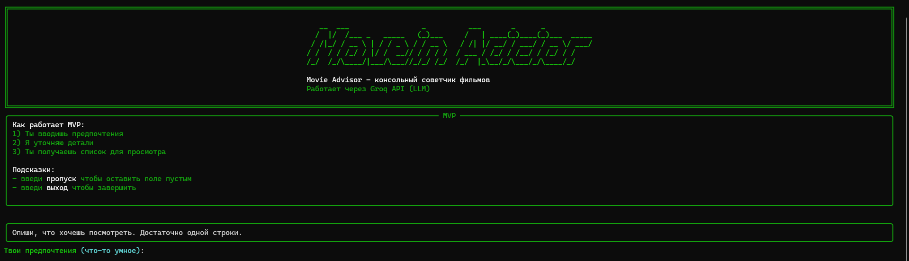

# AI Movies Helper (CLI)

Консольный советчик фильмов и сериалов с красивым интерфейсом (Rich) и генерацией рекомендаций через Groq API.

- Вводишь предпочтения
- Программа уточняет детали (жанры, настроение, эпоха)
- Получаешь список из 10-12 вариантов с короткими пояснениями

## Скриншоты


## Стек

- Python 3.10+
- `rich` - оформление интерфейса
- `aiohttp` - HTTP запросы
- `python-dotenv` - переменные окружения из `.env`

## Файлы проекта

- `index.py` - основной код приложения
- `requirements.txt` - зависимости
- `.env` - ключи и настройки (НЕ коммитить)
- `.gitignore` - исключения для Git

## Установка

1) Клонировать репозиторий или скачать папку проекта.

2) Создать виртуальное окружение (рекомендуется):

```bash
python -m venv .venv
```

3) Активировать окружение:

Windows (PowerShell):

```bash
.\.venv\Scripts\Activate.ps1
```

Windows (cmd):

```bash
.\.venv\Scripts\activate.bat
```

macOS/Linux:

```bash
source .venv/bin/activate
```

4) Установить зависимости:

```bash
pip install -r requirements.txt
```

## Настройка .env

Создай файл `.env` в корне проекта.

Пример:

```env
GROQ_API_KEY=your_groq_api_key_here
GROQ_MODEL=llama-3.1-8b-instant
GROQ_TIMEOUT_SEC=60
GROQ_MAX_TOKENS=900
```

Пояснения:

- `GROQ_API_KEY` - ключ доступа к Groq API
- `GROQ_MODEL` - модель (можно оставить по умолчанию)
- `GROQ_TIMEOUT_SEC` - таймаут запроса в секундах
- `GROQ_MAX_TOKENS` - лимит токенов ответа

Важно:

- Никогда не коммить `.env` в GitHub (GitHub блокирует push, если там найден ключ).

## Запуск

```bash
python index.py
```

После запуска появится интерфейс. Можно:

- выбирать из списка по номерам
- вводить несколько номеров через запятую
- писать свой вариант текстом
- вводить `пропуск` чтобы оставить поле пустым
- вводить `выход` чтобы завершить

## Примечания по JSON

Модель иногда может вернуть ответ с поврежденным JSON.

В `index.py` есть защита:

- запрашивается строгий JSON (через `response_format`, если доступно)
- если все равно сломалось - включается восстановление и показ частичного списка

## requirements.txt (пример)

Если нужно быстро собрать:

```txt
aiohttp>=3.9.0
python-dotenv>=1.0.0
rich>=13.7.0
```

## Учебная цель

Проект сделан как учебный MVP:

- асинхронные запросы
- красивый терминальный UI
- работа с переменными окружения
- базовая устойчивость к ошибкам API

## Структура проекта

```text
.
├── index.py
├── requirements.txt
└── .env
```

